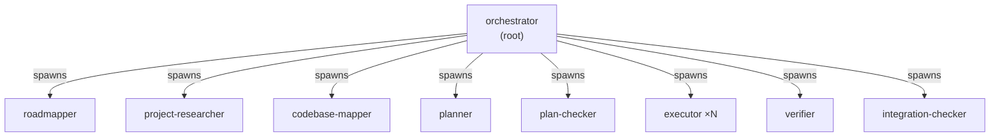

<div align="center">
    <picture>
        
    </picture>
</div>

# openteams

[](https://www.npmjs.com/package/openteams)
[](LICENSE)
[](https://nodejs.org)

A definition layer for multi-agent team structures. Define roles, topology, communication channels, and prompts in YAML — agent systems (Claude Code, Gemini, Codex, etc.) consume the structure and map it to their own runtime primitives.

---

## Table of Contents

- [What It Does](#what-it-does)
- [Quick Start](#quick-start)
- [Architecture](#architecture)
- [Template System](#template-system)
- [Loadouts](#loadouts)
- [Communication Topology](#communication-topology)
- [CLI Command Reference](#cli-command-reference)
- [Library Usage](#library-usage)
- [Examples](#examples)
- [Visual Editor](#visual-editor)
- [Contributing](#contributing)
- [License](#license)

---

## What It Does

OpenTeams is **not** a runtime coordination system. It does not manage state, spawn agents, or track tasks. Instead, it provides:

- **YAML team templates.** Declare roles, topology, spawn rules, communication channels, and enforcement in a `team.yaml` directory. One format, any agent system.
- **Role inheritance.** Roles extend other roles with capability composition (`add`/`remove`). Multi-level chains resolved at load time with cycle detection.
- **Loadouts.** Reusable bundles of skills, capabilities, MCP servers, permissions, and prompt material that bind to roles (by slug or inline). Support single inheritance with canonical merge rules.
- **Communication topology.** Typed signal channels with role subscriptions, emission permissions, peer routing, and enforcement modes — all as structural metadata.
- **Prompt loading.** Single-file or multi-file prompts per role, loaded and resolved alongside the template.
- **Generators.** Produce SKILL.md files, role catalogs, agent prompts, and deployable packages from a template directory.
- **Template installation.** Clone and install templates from git repositories.
- **Visual editor.** Interactive browser-based UI for editing team configurations.

Agent systems read the resolved template and implement runtime behavior (task management, messaging, agent spawning, enforcement) using their own primitives.

---


NEW! [openteams frontend-only config editor](https://team-config.swarmkit.ai/)

---

## Quick Start

**Prerequisites:** Node.js >= 18

```bash
npm install -g openteams
```

### Validate a template

```bash
openteams template validate ./examples/gsd
```

```
Template "gsd" is valid.
  Version: 1
  Roles: orchestrator, roadmapper, planner, plan-checker, executor, verifier ...
  Root: orchestrator
  Channels: project_lifecycle, planning_events, execution_events, verification_events
```

### Generate artifacts

```bash
# Generate SKILL.md + agent prompt files
openteams generate all ./examples/gsd -o ./output/gsd
```

```
Generated ./output/gsd/SKILL.md
  orchestrator -> ./output/gsd/agents/orchestrator.md
  planner -> ./output/gsd/agents/planner.md
  ...

Generated SKILL.md + 12 agent prompt(s) for team "gsd"
```

### Install a template from git

```bash
openteams template install owner/repo
```

---

## Architecture

```
src/
  cli.ts                 # Entry point: template, generate, editor commands
  index.ts               # Public API exports
  cli/                   # CLI command definitions
  template/
    loader.ts            # TemplateLoader — YAML parsing, role inheritance, prompt loading
    types.ts             # All type definitions
    install-service.ts   # Git-based template installation
  generators/
    skill-generator.ts   # generateSkillMd(), generateCatalog()
    agent-prompt-generator.ts  # generateAgentPrompts(), generateRoleSkillMd()
    package-generator.ts # generatePackage()
schema/
  team.schema.json       # JSON Schema for team.yaml
  role.schema.json       # JSON Schema for role YAML
examples/
  gsd/                   # 12-role team with wave-based execution
  bmad-method/           # 10-role agile development team
```

No database. No runtime state. Templates are the source of truth.

---

## Template System

A template is a directory that declares a team structure in YAML.

### Directory Structure

```
templates/my-team/
├── team.yaml              # Manifest: topology, communication, role list
├── roles/
│   ├── planner.yaml       # Role definition with capabilities
│   └── executor.yaml      # Role with optional loadout binding
├── loadouts/              # Reusable skill/capability/MCP/permission bundles
│   ├── code-reviewer.yaml
│   └── security-auditor.yaml  # Can extend other loadouts
├── prompts/
│   ├── planner.md         # Single-file prompt (simple roles)
│   └── executor/          # Multi-file prompt directory (complex roles)
│       ├── SOUL.md        # Personality, values, communication style
│       ├── ROLE.md        # Operational instructions (primary)
│       └── RULES.md       # Constraints (optional)
└── tools/
    └── mcp-servers.json   # MCP server config per role (legacy; prefer loadouts)
```

### Minimal team.yaml

```yaml
name: my-team
version: 1
roles: [coordinator, worker]

topology:
  root:
    role: coordinator
  spawn_rules:
    coordinator: [worker]
    worker: []
```

### Full team.yaml with communication

```yaml
name: self-driving
description: "Autonomous codebase development"
version: 1
roles: [planner, grinder, judge]

topology:
  root:
    role: planner
    prompt: prompts/planner.md
    config: { model: sonnet }
  companions:
    - role: judge
      prompt: prompts/judge.md
  spawn_rules:
    planner: [grinder, planner]
    judge: []
    grinder: []

communication:
  enforcement: audit
  channels:
    task_updates:
      description: "Task lifecycle events"
      signals: [TASK_CREATED, TASK_COMPLETED, TASK_FAILED]
    work_coordination:
      signals: [WORK_ASSIGNED, WORKER_DONE]
  subscriptions:
    planner:
      - channel: task_updates
      - channel: work_coordination
        signals: [WORKER_DONE]
    judge:
      - channel: task_updates
        signals: [TASK_FAILED]
    grinder:
      - channel: work_coordination
        signals: [WORK_ASSIGNED]
  emissions:
    planner: [TASK_CREATED, WORK_ASSIGNED]
    grinder: [WORKER_DONE]
  routing:
    peers:
      - from: judge
        to: planner
        via: direct
        signals: [FIXUP_CREATED]

# Extension fields: stored but not interpreted by openteams
macro_agent:
  task_assignment: { mode: pull }
```

### Role Definitions

Roles live in `roles/<name>.yaml` and support single inheritance via `extends`:

```yaml
# roles/senior-dev.yaml
name: senior-dev
capabilities: [code, review, deploy]

# roles/junior-dev.yaml
name: junior-dev
extends: senior-dev
capabilities:
  add: [debug]
  remove: [deploy]
# Resolved capabilities: [code, review, debug]
```

Multi-level chains (`A extends B extends C`) are resolved in topological order. Circular inheritance is detected and rejected at load time.

---

## Loadouts

A **loadout** is a reusable bundle of everything an agent needs to do its job beyond its identity: skills, capabilities, MCP servers, permissions, and prompt material. Loadouts are decoupled from roles — one loadout can equip multiple roles, across multiple teams — and they support single inheritance, so you can compose a `security-auditor` on top of a generic `code-reviewer` without repeating yourself.

Loadouts are a **definition-layer** concept. OpenTeams stores, resolves, and attaches them; the consuming agent system (Claude Code, Gemini, Codex, etc.) materializes each loadout into its own runtime artifacts (`.mcp.json`, settings, skill bundles).

### Anatomy of a loadout

```yaml
# loadouts/security-auditor.yaml
name: security-auditor
extends: code-reviewer           # optional — inherit from another loadout

skills:
  profile: security-engineer     # named profile for a skill system
  include: [owasp-top-10]        # explicit skill slugs
  exclude: []
  max_tokens: 50000              # optional budget hint

capabilities: [file.read, git.diff, exec.test]   # flat list
# or: capabilities_add / capabilities_remove relative to the parent

mcp_servers:
  - name: ast-grep                             # inline entry
    command: npx
    args: [ast-grep-mcp]
  - ref: "@openhive/secrets-scanner"           # symbolic ref — consumer resolves

permissions:
  allow: ["Read(**)", "Bash(npm audit:*)"]
  deny:  ["Bash(git push:*)"]                  # deny always wins across inheritance
  ask:   ["Write(.env)"]

prompt_addendum: |
  ## Security Focus
  Prioritize authn gaps, injection vectors, exposed secrets.
```

### Binding loadouts to roles

A role picks up a loadout in one of three ways:

```yaml
# 1. No loadout — role runs bare (existing behavior, still valid)
name: planner
capabilities: [task.create, task.assign]

# 2. Slug reference — points at loadouts/<name>.yaml
name: implementer
loadout: implementer

# 3. Inline definition — declare a one-off loadout at the binding site
name: reviewer
loadout:
  extends: security-auditor
  capabilities_add: [task.update]
  prompt_addendum: |
    Be direct but kind. Cite specific lines.
```

The inline form is a convenience for one-off tweaks — you don't have to create a separate YAML file just to add a capability or permission for a single role.

### Inheritance — merge rules

When a child loadout `extends` a parent, each field has a canonical merge strategy:

| Field | Strategy |
|---|---|
| `skills.profile` | Child replaces parent if set |
| `skills.include` / `exclude` | Union (deduplicated) |
| `skills.max_tokens` | Child replaces parent if set |
| `capabilities` | Same as role inheritance — composition (`add`/`remove`) or replacement |
| `mcp_servers` | Union by `name` (or `ref`); child wins on conflict |
| `permissions.allow` / `ask` | Union |
| `permissions.deny` | Union — **deny always wins**, child cannot drop a parent deny |
| `prompt_addendum` | Concatenated parent → child, separated by a blank line |

Multi-level chains and circular inheritance detection work the same way as roles.

### Consuming systems

OpenTeams itself never writes `.mcp.json`, settings files, or skill bundles. It resolves loadouts and hands `ResolvedTemplate.loadouts` / `ResolvedRole.loadout` to the consuming system, which decides how to materialize each piece:

- **MCP servers** — consumer writes `loadout.mcpServers` to whatever config its runtime expects. Symbolic `ref:` entries are resolved against the consumer's own registry (OpenTeams does not ship one).
- **Permissions** — shape is agent-system-agnostic and inspired by Claude Code's allow/deny/ask syntax; consumers can adopt it directly or map it to their own permission model.
- **Skills** — consumer with a skill system (e.g. [skill-tree](https://github.com/alexngai/skill-tree)) compiles `loadout.skills` into a prompt bundle. OpenTeams itself doesn't ship a skill compiler.
- **Prompt addendum** — appended after the role's primary prompt when rendering agent markdown.

### Customization hooks

For consumers that need to override or supply loadouts from outside the template directory (databases, user settings, remote registries), the loader exposes two hooks:

```typescript
TemplateLoader.loadAsync(dir, {
  // Supply or override a loadout by name
  resolveExternalLoadout: async (name) => getDbLoadout(hiveId, name),
  // Post-process every resolved loadout (e.g. apply per-tenant tweaks)
  postProcessLoadout:    (lo) => applyOverrides(hiveId, lo),
});
```

This is how systems like [OpenHive](https://github.com/alexngai/openhive) layer per-deployment loadout overrides on top of shared YAML templates without forking the template repo.

### Complete example

See `examples/loadout-demo/` for a working three-role team that exercises all three binding styles (no loadout, slug reference, inline-with-extends) and demonstrates multi-level loadout inheritance.

---

## Communication Topology

Communication config is structural metadata that agent systems read and implement. OpenTeams defines the contract; enforcement is up to the consuming system.

### Channels and Signals

A channel groups related signals. Roles subscribe to channels with optional signal-level filtering.

```yaml
subscriptions:
  analyst:
    - channel: phase_transitions        # receives all signals
  pm:
    - channel: phase_transitions
      signals: [ANALYSIS_COMPLETE]     # receives only this signal
```

### Peer Routes

Direct role-to-role routing for specific signals. Three modes:

| Via | Meaning |
|-----|---------|
| `direct` | Signal is routed directly from one role to another |
| `topic` | Signal is routed via a named topic |
| `scope` | Signal is scoped to a context boundary |

### Enforcement Modes

Set via `communication.enforcement` in the manifest. Interpretation is left to the consuming agent system.

| Mode | Intent |
|------|--------|
| `permissive` (default) | All signal emissions allowed regardless of declared permissions |
| `audit` | Unauthorized emissions are flagged but not blocked |
| `strict` | Unauthorized emissions should be rejected |

---

## CLI Command Reference

### Template

| Command | Description |
|---------|-------------|
| `openteams template validate <dir>` | Validate a template without side effects |
| `openteams template install <repo-url> [name]` | Install a template from a git repository |

**Options for `template install`:**

| Flag | Description |
|------|-------------|
| `-o, --output <path>` | Install to a specific directory |
| `-y, --yes` | Skip confirmation prompts |

### Generate

Generate artifacts from a template directory.

| Command | Description |
|---------|-------------|
| `openteams generate skill <dir>` | Generate `SKILL.md` from a template |
| `openteams generate catalog <dir>` | Generate a lightweight role catalog |
| `openteams generate agents <dir>` | Generate one prompt file per role |
| `openteams generate all <dir>` | Generate `SKILL.md` + all agent prompts |
| `openteams generate package <dir>` | Generate a deployable skill package directory |
| `openteams generate role-package <dir> -r <role>` | Generate a standalone `SKILL.md` for one role |

All `generate` commands accept `-n, --name <name>` to override the team name and `-o, --output <path>` to control output location.

### Editor

| Command | Description |
|---------|-------------|
| `openteams editor` | Launch visual team configuration editor |

**Options:**

| Flag | Default | Description |
|------|---------|-------------|
| `-d, --dir <path>` | cwd | Template directory to load |
| `-p, --port <port>` | `5173` | Port for the editor server |

---

## Library Usage

```bash
npm install openteams
```

### Loading Templates

```typescript
import { TemplateLoader } from "openteams";

// Load from a directory
const template = TemplateLoader.load("./examples/gsd");

console.log(template.manifest.name);        // "gsd"
console.log(template.manifest.roles);        // ["orchestrator", "roadmapper", ...]
console.log(template.manifest.topology);     // { root, companions, spawn_rules }
console.log(template.manifest.communication); // { channels, subscriptions, emissions, routing }

// Access resolved roles (after inheritance)
const planner = template.roles.get("planner");
console.log(planner.capabilities);           // ["plan", "coordinate", ...]

// Access loaded prompts
const prompts = template.prompts.get("planner");
console.log(prompts.primary);               // Content of prompt.md or ROLE.md
console.log(prompts.additional);            // Additional prompt sections

// Access loadouts (if the template defines any)
for (const [name, lo] of template.loadouts) {
  console.log(name, lo.capabilities, lo.mcpServers, lo.permissions);
}
// Each role with a loadout binding has it attached post-resolution:
const reviewer = template.roles.get("reviewer");
if (reviewer?.loadout) {
  console.log(reviewer.loadout.capabilities);
  console.log(reviewer.loadout.mcpServers);
  console.log(reviewer.loadout.permissions);
  console.log(reviewer.loadout.skills);
  console.log(reviewer.loadout.promptAddendum);
}
```

### Async Loading with Hooks

```typescript
import { TemplateLoader } from "openteams";

const template = await TemplateLoader.loadAsync("./my-team", {
  resolveExternalRole: async (name) => {
    // Resolve roles not found in the local roles/ directory
    return fetchRoleFromRegistry(name);
  },
  postProcessRole: (role, manifest) => {
    // Enrich roles after inheritance resolution
    return { ...role, description: `${role.description} (enriched)` };
  },
  postProcess: (template) => {
    // Transform the entire template after loading
    return template;
  },
});
```

### Generating Artifacts

```typescript
import { TemplateLoader, generateSkillMd, generateAgentPrompts, generatePackage } from "openteams";

const template = TemplateLoader.load("./my-team");

// Generate SKILL.md content
const skillMd = generateSkillMd(template, { teamName: "my-team" });

// Generate per-role prompt files
const prompts = generateAgentPrompts(template, { teamName: "my-team" });
for (const p of prompts) {
  console.log(`${p.role}: ${p.prompt.length} chars`);
}

// Generate a deployable package (writes files to disk)
const pkg = generatePackage(template, { teamName: "my-team", outputDir: "./out" });
```

### Installing Templates

```typescript
import { TemplateInstallService } from "openteams";

const installer = new TemplateInstallService();
const result = await installer.install(
  { repoUrl: "owner/repo" },
  {
    selectTemplate: async (templates) => templates[0].name,
    confirmGlobalInstall: async () => true,
    onProgress: (msg) => console.log(msg),
  }
);
console.log(`Installed to: ${result.installedPath}`);
```

---

## Examples

Two complete team templates are included in the `examples/` directory.

### BMAD Method (`examples/bmad-method/`)

A 10-role agile development team structured around four phases: analysis, planning, solutioning, and implementation.

**Roles:** `master`, `analyst`, `pm`, `ux-designer`, `architect`, `scrum-master`, `developer`, `qa`, `tech-writer`, `quick-flow-dev`

**Channels:** `phase_transitions`, `artifact_ready`, `sprint_events`, `quality_events`

**Enforcement:** `audit`

### GSD (`examples/gsd/`)

A 12-role autonomous development system with wave-based parallel execution.



The orchestrator runs a research phase, produces a roadmap, validates a plan, then spawns executor waves. Verifiers check each completed phase.

**Channels:** `project_lifecycle`, `planning_events`, `execution_events`, `verification_events`

**Enforcement:** `permissive`

```bash
openteams template validate ./examples/gsd
openteams generate all ./examples/gsd -o ./output/gsd
```

---

## Visual Editor

OpenTeams includes a browser-based visual editor for designing and editing team configurations. Load any bundled example template or start from a blank canvas, then visually arrange roles, channels, communication topology, and spawn rules.

**Features:**

- **Canvas-based editing.** Drag and connect role and channel nodes. Auto-layout for quick organization.
- **Template library.** Load any example template from a dropdown, or clear the canvas to start fresh.
- **Inspector panel.** Edit role identity, communication subscriptions, emissions, peer routes, spawn rules, capabilities, and prompts.
- **Layer toggles.** Show or hide peer routes, signal flow edges, spawn rules, and inheritance edges independently.
- **Import/Export.** Paste raw YAML to import, or export the current configuration as a downloadable template directory (zip).
- **Validation.** Real-time error and warning indicators for missing references, orphaned signals, and schema issues.
- **Light/dark theme.** Toggle between dark, light, and system themes.

### Running the editor

```bash
# Via CLI (serves the built editor)
openteams editor

# For development
cd editor
npm run dev
```

---

## Contributing

```bash
git clone <repo>
cd openteams
npm install
npm run build
npm test
```

Run a single test file:

```bash
npx vitest run src/template/loader.test.ts
```

No database or external services required. Tests use filesystem fixtures and inline manifests.

---

## License

MIT
