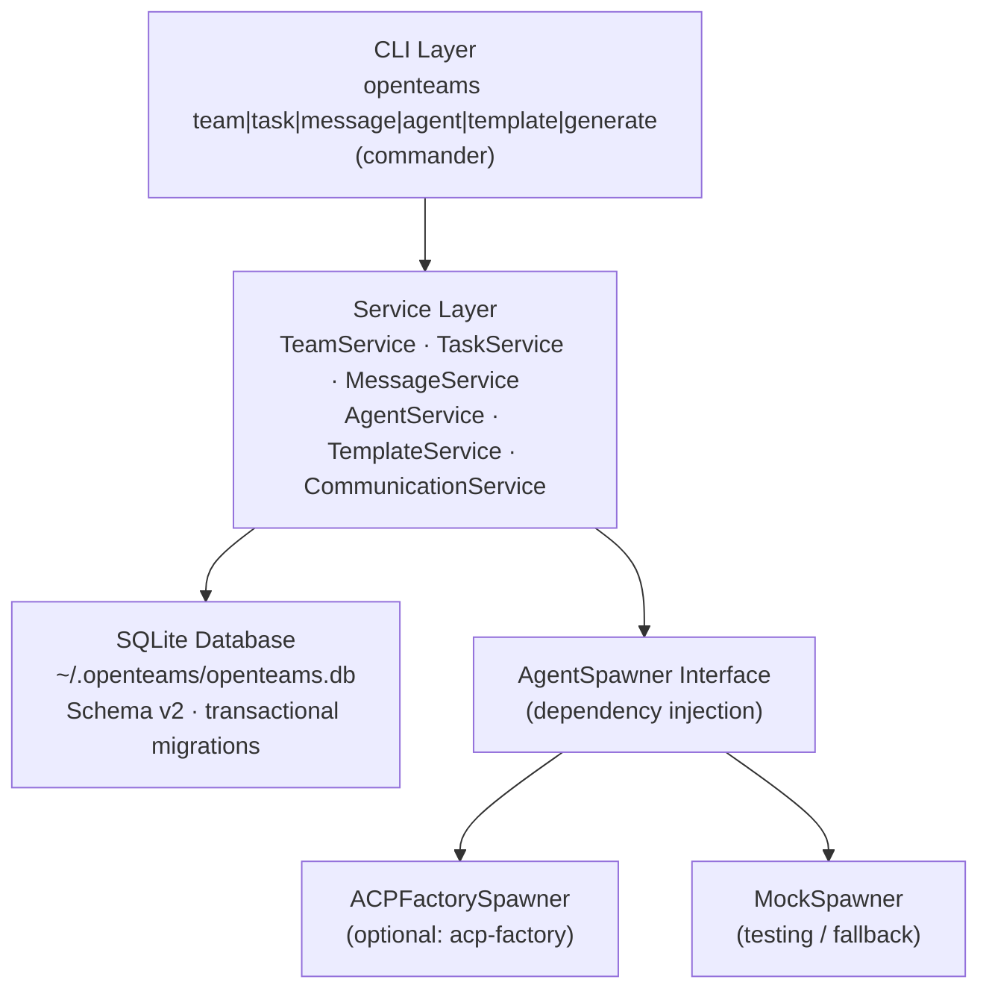
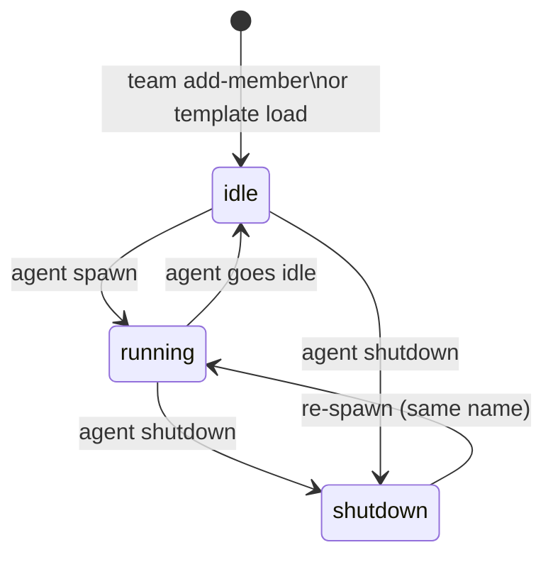
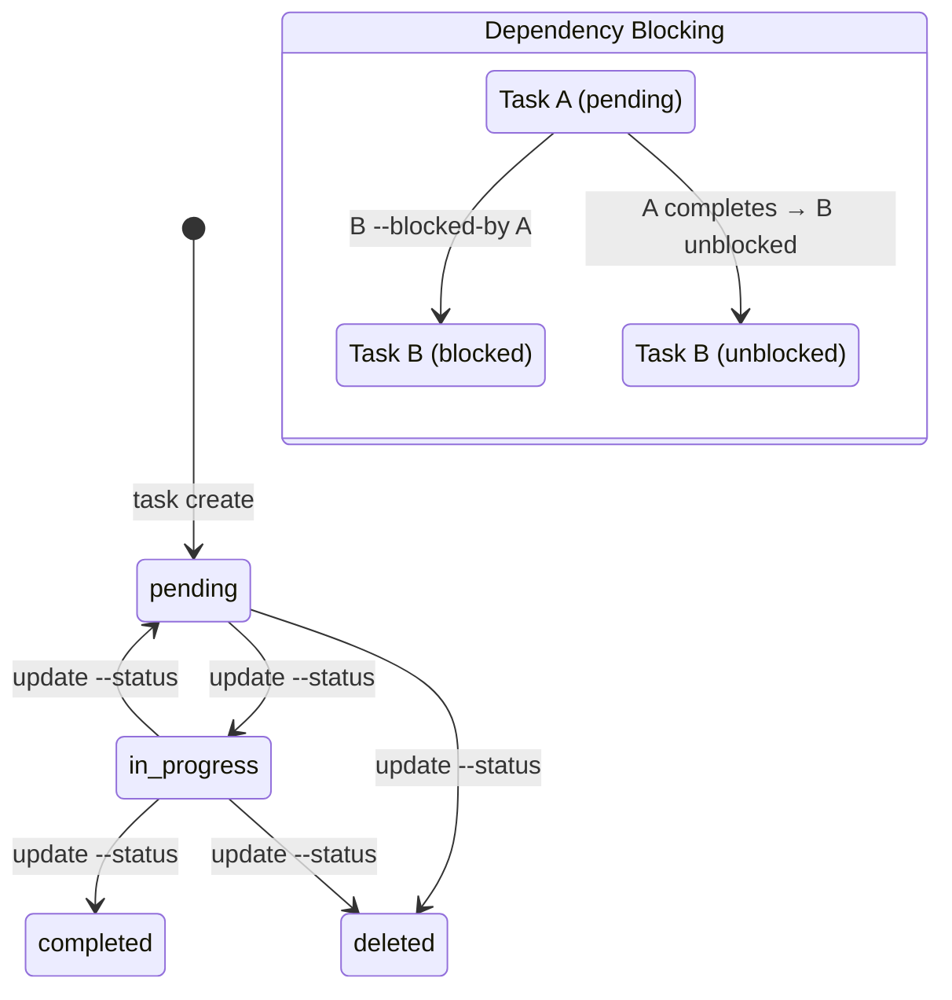
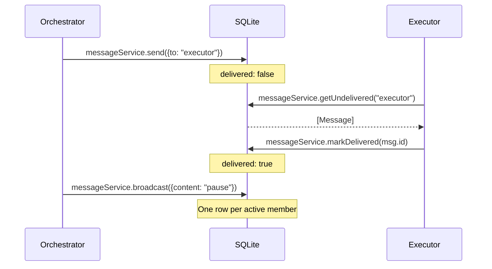
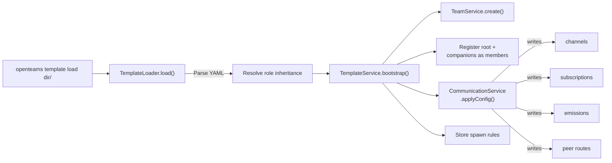
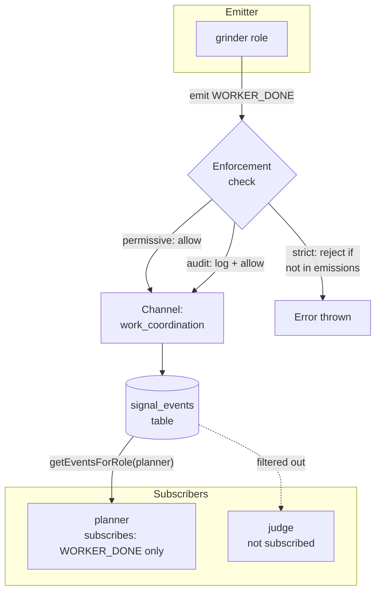
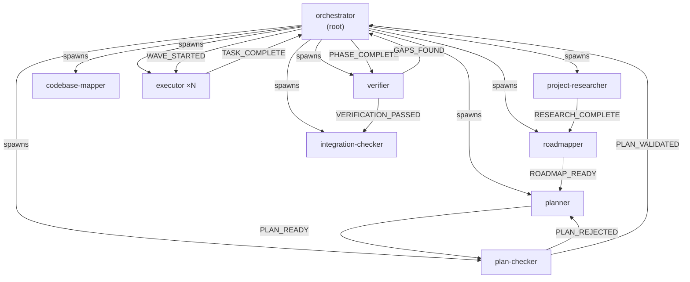

# openteams

[](https://www.npmjs.com/package/openteams)
[](LICENSE)
[](https://nodejs.org)

CLI and TypeScript library for coordinating multi-agent teams. Teams, tasks, messages, and agent spawning in a SQLite-backed store.

---

## Table of Contents

- [What You Get](#what-you-get)
- [Quick Start](#quick-start)
- [Architecture](#architecture)
- [Core Concepts](#core-concepts)
- [CLI Command Reference](#cli-command-reference)
- [Template System](#template-system)
- [Communication System](#communication-system)
- [Library Usage](#library-usage)
- [Examples](#examples)
- [Limitations](#limitations)
- [Troubleshooting](#troubleshooting)
- [Contributing](#contributing)
- [License](#license)

---

## The Problem

Multi-agent systems need shared state. When you run multiple AI agents on a codebase, each one needs to know what tasks exist, who owns them, what is blocked, and what other agents have said. There is no standard place to put that state.

Claude Code's Agent Teams provides the right primitives: shared task lists, inter-agent messaging, spawn rules, and team lifecycle. OpenTeams extracts those primitives into a standalone CLI backed by SQLite. Any process with shell access can read and write team state via the CLI. Any TypeScript codebase can implement the `AgentSpawner` interface to connect its own agent backend.

---

## What You Get

- **Shared task list with dependency tracking.** Create tasks, assign owners, declare blockers. The service rejects circular dependencies at write time.
- **Inter-agent messaging with delivery tracking.** Direct messages, broadcast, shutdown requests. Agents poll for undelivered messages and acknowledge receipt.
- **YAML team templates.** Declare roles, spawn rules, communication channels, and enforcement in a single `team.yaml`. Load it once, get a fully wired team.
- **Pluggable agent spawning.** Implement the `AgentSpawner` interface to connect any agent backend. Ships with an ACP (Agent Client Protocol) spawner and a mock for testing.
- **Signal-based communication.** Typed events on named channels. Role subscriptions with signal filtering. Three enforcement modes: permissive, audit, strict.
- **Generators.** Produce SKILL.md files, role catalogs, agent prompts, and deployable packages from a template directory.

---

## Quick Start

**Prerequisites:** Node.js >= 18

```bash
npm install -g openteams
```

### Option A: Manual team setup

Create a team, add members, create tasks with dependencies, and coordinate with messages.

```bash
# Create a team
openteams team create api-project --description "Build the payments API"
```

```
Team "api-project" created.
  Description: Build the payments API
```

```bash
# Register two agents
openteams team add-member api-project planner --role planner
openteams team add-member api-project executor-1 --role executor
```

```bash
# Create tasks with a dependency chain
openteams task create api-project \
  -s "Design webhook schema" \
  -d "Define payload format for inbound payment events"
```

```
Task #1 created in team "api-project".
  Subject: Design webhook schema
  Status: pending
```

```bash
openteams task create api-project \
  -s "Implement webhook handler" \
  -d "Parse and persist inbound payment events" \
  --blocked-by 1
```

```
Task #2 created in team "api-project".
  Subject: Implement webhook handler
  Status: pending
  Blocked by: #1
```

```bash
# Assign and communicate
openteams task update api-project 1 --status in_progress --owner planner
openteams message send api-project \
  --from planner --to executor-1 \
  --content "Schema is ready. Task #2 is unblocked." \
  --summary "Schema complete, begin implementation"

# Executor polls for messages
openteams message poll api-project --agent executor-1 --mark-delivered
```

```
[1] From planner: Schema is ready. Task #2 is unblocked.
    Summary: Schema complete, begin implementation
    (marked as delivered)
```

```bash
# Check what's ready to work on
openteams task list api-project --status pending
```

```
ID  Subject                     Status   Owner  Blocked By
2   Implement webhook handler   pending  -      #1
```

If you see Task #2 with status `pending` and blocked by `#1`, the dependency chain is wired correctly.

### Option B: Load a template

Templates declare an entire team topology in a single YAML directory. One command creates the team, registers members, and wires communication channels.

```bash
openteams template load ./examples/get-shit-done
```

```
Team "get-shit-done" created from template.
  Roles: orchestrator, roadmapper, planner, plan-checker, executor, verifier ...
  Channels: project_lifecycle, planning_events, execution_events, verification_events
```

```bash
# Inspect the topology
openteams template info get-shit-done
```

```bash
# Generate agent prompts and SKILL.md from the template
openteams generate all ./examples/get-shit-done -o ./output/gsd
```

```
Generated:
  ./output/gsd/SKILL.md
  ./output/gsd/agents/orchestrator.md
  ./output/gsd/agents/planner.md
  ...
```

---

## Architecture



The CLI layer delegates directly to services. Services own all business logic: dependency cycle detection, message delivery tracking, signal enforcement, and inheritance resolution. The database layer handles schema versioning with transactional migrations. The spawner interface is a dependency-injected contract; the CLI loads `ACPFactorySpawner` if `acp-factory` is installed, otherwise falls back to `MockSpawner`.

---

## Core Concepts

### Teams

A team is the top-level namespace for all state. Tasks, messages, members, channels, and signal events all belong to a team. Teams track which template they were created from and which enforcement mode governs signal emissions.

### Members

Members are named agents registered within a team. A member has a role, a status, and optionally an `agent_id` set after spawning.



You can register members manually with `team add-member` or let `template load` auto-populate them from the manifest.

### Tasks

Tasks are shared work items with a status workflow and dependency edges.



The service enforces cycle detection at write time: if adding a dependency would create a circular chain, the operation returns an error.

### Messages

Messages are the inter-agent communication layer. Five types:

| Type | Purpose |
|------|---------|
| `message` | Direct message from one agent to another |
| `broadcast` | One-to-all message within a team |
| `shutdown_request` | Ask an agent to shut down |
| `shutdown_response` | Response to a shutdown request |
| `plan_approval_response` | Response to a plan approval request |

Each message tracks delivery status. Agents poll for undelivered messages and acknowledge receipt.



### Templates

Templates are YAML manifests that declare a team's topology, roles, spawn rules, and communication channels in a single directory. Loading a template creates the team, registers members, and wires all communication configuration in one step. See [Template System](#template-system).

### Signals

Signals are typed events emitted on named channels. Roles subscribe to channels (optionally filtered by signal name). When a role emits a signal, the enforcement mode decides what happens: `permissive` allows all emissions, `audit` records unauthorized ones without blocking, and `strict` rejects them. See [Communication System](#communication-system).

### Key Types

Types returned by service methods. All are exported from the `openteams` package.

**Task**

| Property | Type | Description |
|----------|------|-------------|
| `id` | `number` | Auto-incrementing task ID |
| `team_name` | `string` | Owning team |
| `subject` | `string` | Task title |
| `description` | `string` | Full description |
| `status` | `"pending" \| "in_progress" \| "completed" \| "deleted"` | Workflow state |
| `owner` | `string \| null` | Assigned agent name |
| `active_form` | `string \| null` | Present continuous label, e.g. "Designing API" |
| `metadata` | `Record<string, unknown>` | Arbitrary JSON |

**Message**

| Property | Type | Description |
|----------|------|-------------|
| `id` | `number` | Message ID |
| `type` | `"message" \| "broadcast" \| "shutdown_request" \| "shutdown_response" \| "plan_approval_response"` | Message type |
| `sender` | `string` | Sender agent name |
| `recipient` | `string \| null` | Recipient (null for broadcasts stored per-recipient) |
| `content` | `string` | Message body |
| `summary` | `string \| null` | Short preview (5-10 words) |
| `delivered` | `boolean` | Whether the recipient has acknowledged |

**Member**

| Property | Type | Description |
|----------|------|-------------|
| `id` | `number` | Auto-incrementing row ID |
| `team_name` | `string` | Owning team |
| `agent_name` | `string` | Name within the team |
| `agent_id` | `string \| null` | Spawner-assigned ID (set after spawn) |
| `role` | `string \| null` | Role from template or manual assignment |
| `status` | `"idle" \| "running" \| "shutdown"` | Agent lifecycle state |
| `agent_type` | `string` | Agent type, e.g. `"general-purpose"` |
| `model` | `string \| null` | Model identifier |

---

## CLI Command Reference

### Team

| Command | Description |
|---------|-------------|
| `openteams team create <name>` | Create a new team |
| `openteams team list` | List all active teams |
| `openteams team info <name>` | Show team details and members |
| `openteams team add-member <team> <name>` | Register a member without spawning |
| `openteams team delete <name>` | Delete a team (all members must be shut down first) |

**Options for `team create`:**

| Flag | Description |
|------|-------------|
| `-d, --description <text>` | Team description |
| `-t, --agent-type <type>` | Agent type for team lead |

**Options for `team add-member`:**

| Flag | Default | Description |
|------|---------|-------------|
| `-r, --role <role>` | none | Role name for this member |
| `-t, --type <type>` | `general-purpose` | Agent type |
| `-m, --model <model>` | none | Model identifier |

### Task

| Command | Description |
|---------|-------------|
| `openteams task create <team>` | Create a new task |
| `openteams task list <team>` | List tasks with optional filters |
| `openteams task get <team> <id>` | Get full task details |
| `openteams task update <team> <id>` | Update a task |

**Options for `task create`:**

| Flag | Required | Description |
|------|----------|-------------|
| `-s, --subject <text>` | Yes | Task title |
| `-d, --description <text>` | Yes | Task description |
| `-a, --active-form <text>` | No | Present continuous form, e.g. "Designing API" |
| `--blocked-by <ids>` | No | Comma-separated task IDs that block this task |
| `--metadata <json>` | No | JSON metadata blob |

**Options for `task list`:**

| Flag | Description |
|------|-------------|
| `--status <status>` | Filter: `pending`, `in_progress`, `completed` |
| `--owner <name>` | Filter by assigned agent name |
| `--json` | Output as JSON |

**Options for `task update`:**

| Flag | Description |
|------|-------------|
| `--status <status>` | `pending`, `in_progress`, `completed`, or `deleted` |
| `--owner <name>` | Assign to an agent |
| `-s, --subject <text>` | New title |
| `-d, --description <text>` | New description |
| `--add-blocks <ids>` | Task IDs this task now blocks |
| `--add-blocked-by <ids>` | Task IDs that now block this task |
| `--metadata <json>` | JSON to merge into existing metadata |

### Message

| Command | Description |
|---------|-------------|
| `openteams message send <team>` | Send a direct message |
| `openteams message broadcast <team>` | Broadcast to all team members |
| `openteams message shutdown <team>` | Send a shutdown request |
| `openteams message shutdown-response <team>` | Respond to a shutdown request |
| `openteams message plan-response <team>` | Respond to a plan approval request |
| `openteams message list <team>` | List messages |
| `openteams message poll <team>` | Poll for undelivered messages for an agent |
| `openteams message ack <team> <id>` | Acknowledge a message |

**Options for `message send`:**

| Flag | Required | Description |
|------|----------|-------------|
| `--to <name>` | Yes | Recipient agent name |
| `--content <text>` | Yes | Message body |
| `--summary <text>` | Yes | Short summary (5-10 words) |
| `--from <name>` | No | Sender name (default: `lead`) |

**Options for `message poll`:**

| Flag | Description |
|------|-------------|
| `--agent <name>` | Agent name to poll for |
| `--mark-delivered` | Acknowledge all returned messages |
| `--json` | Output as JSON |

### Agent

| Command | Description |
|---------|-------------|
| `openteams agent spawn <team>` | Spawn a new agent |
| `openteams agent list <team>` | List agents in a team |
| `openteams agent info <team> <name>` | Show agent details |
| `openteams agent shutdown <team> <name>` | Shut down an agent |

**Options for `agent spawn`:**

| Flag | Required | Default | Description |
|------|----------|---------|-------------|
| `-n, --name <name>` | Yes | | Agent name |
| `-p, --prompt <text>` | Yes | | System prompt |
| `-t, --type <type>` | No | `general-purpose` | `bash`, `general-purpose`, `explore`, or `plan` |
| `-m, --model <model>` | No | | `sonnet`, `opus`, or `haiku` |
| `--cwd <dir>` | No | | Working directory |

### Template

| Command | Description |
|---------|-------------|
| `openteams template load <dir>` | Load a template and create a team |
| `openteams template validate <dir>` | Validate a template without creating a team |
| `openteams template info <team>` | Show template topology for a team |
| `openteams template emit <team>` | Emit a signal on a channel |
| `openteams template events <team>` | List signal events |

**Options for `template emit`:**

| Flag | Required | Description |
|------|----------|-------------|
| `-c, --channel <channel>` | Yes | Channel name |
| `-s, --signal <signal>` | Yes | Signal name |
| `--sender <name>` | Yes | Role or agent emitting the signal |
| `-p, --payload <json>` | No | JSON payload |

**Options for `template events`:**

| Flag | Description |
|------|-------------|
| `-c, --channel <channel>` | Filter by channel |
| `-s, --signal <signal>` | Filter by signal |
| `--sender <name>` | Filter by sender |
| `--role <role>` | Show only events visible to this role (subscription-filtered) |

### Generate

Generate deployable artifacts from a template directory.

| Command | Description |
|---------|-------------|
| `openteams generate skill <dir>` | Generate `SKILL.md` from a template |
| `openteams generate catalog <dir>` | Generate a lightweight role catalog |
| `openteams generate agents <dir>` | Generate one prompt file per role |
| `openteams generate all <dir>` | Generate `SKILL.md` + all agent prompts |
| `openteams generate package <dir>` | Generate a deployable skill package directory |
| `openteams generate role-package <dir> -r <role>` | Generate a standalone `SKILL.md` for one role |

All `generate` commands accept `-o, --output <path>` to control where files are written. `generate agents` defaults to `<dir>/agents/`. `generate skill` defaults to `<dir>/SKILL.md`.

---

## Template System

A template is a directory that defines a team declaratively. Loading a template creates the SQLite records for the team, members, channels, subscriptions, emissions, peer routes, and spawn rules.

### Directory Structure

```
templates/my-team/
├── team.yaml              # Manifest: topology, communication, role list
├── roles/
│   ├── planner.yaml       # Role definition with capabilities
│   └── executor.yaml
├── prompts/
│   ├── planner.md         # Single-file prompt (simple roles)
│   └── executor/          # Multi-file prompt directory (complex roles)
│       ├── SOUL.md        # Personality, values, communication style
│       ├── ROLE.md        # Operational instructions (primary)
│       └── RULES.md       # Constraints (optional)
└── tools/
    └── mcp-servers.json   # MCP server config per role (optional)
```

### Minimal team.yaml

```yaml
name: my-team
version: 1
roles: [coordinator, worker]

topology:
  root:
    role: coordinator
  spawn_rules:
    coordinator: [worker]
    worker: []
```

### Full team.yaml with communication

```yaml
name: self-driving
description: "Autonomous codebase development"
version: 1
roles: [planner, grinder, judge]

topology:
  root:
    role: planner
    prompt: prompts/planner.md
    config: { model: sonnet }
  companions:
    - role: judge
      prompt: prompts/judge.md
  spawn_rules:
    planner: [grinder, planner]
    judge: []
    grinder: []

communication:
  enforcement: audit
  channels:
    task_updates:
      description: "Task lifecycle events"
      signals: [TASK_CREATED, TASK_COMPLETED, TASK_FAILED]
    work_coordination:
      signals: [WORK_ASSIGNED, WORKER_DONE]
  subscriptions:
    planner:
      - channel: task_updates
      - channel: work_coordination
        signals: [WORKER_DONE]
    judge:
      - channel: task_updates
        signals: [TASK_FAILED]
    grinder:
      - channel: work_coordination
        signals: [WORK_ASSIGNED]
  emissions:
    planner: [TASK_CREATED, WORK_ASSIGNED]
    grinder: [WORKER_DONE]
  routing:
    peers:
      - from: judge
        to: planner
        via: direct
        signals: [FIXUP_CREATED]

# Extension fields: stored but not interpreted by openteams
macro_agent:
  task_assignment: { mode: pull }
```

### Role Definitions

Roles live in `roles/<name>.yaml` and support single inheritance via `extends`:

```yaml
# roles/senior-dev.yaml
name: senior-dev
capabilities: [code, review, deploy]

# roles/junior-dev.yaml
name: junior-dev
extends: senior-dev
capabilities:
  add: [debug]
  remove: [deploy]
# Resolved capabilities: [code, review, debug]
```

Multi-level chains (`A extends B extends C`) are resolved in topological order. Circular inheritance is detected and rejected at load time.

### Bootstrap Flow



### Validate Before Loading

```bash
openteams template validate ./my-team
# Validates schema, role inheritance, and channel references without writing to the database
```

---

## Communication System

OpenTeams implements a typed pub/sub layer on top of SQLite. Communication config is stored per-team after a template loads.



### Channels and Signals

A channel groups related signals. Roles subscribe to channels with optional signal-level filtering.

```bash
# Emit a signal
openteams template emit self-driving \
  -c task_updates \
  -s TASK_COMPLETED \
  --sender grinder-1 \
  -p '{"taskId": 42}'

# View all events for a channel
openteams template events self-driving -c task_updates

# View only events visible to the judge role (subscription-filtered)
openteams template events self-driving --role judge
```

### Subscription Filtering

A role subscribes to a channel. If `signals` is omitted, the role receives all signals in that channel. If `signals` is provided, the role receives only those named signals.

```yaml
subscriptions:
  analyst:
    - channel: phase_transitions        # receives all signals
  pm:
    - channel: phase_transitions
      signals: [ANALYSIS_COMPLETE]     # receives only this signal
```

### Peer Routes

Peer routes declare direct role-to-role routing for specific signals. Three modes:

| Via | Meaning |
|-----|---------|
| `direct` | Signal is routed directly from one role to another |
| `topic` | Signal is routed via a named topic |
| `scope` | Signal is scoped to a context boundary |

### Enforcement Modes

Set at the team level via `communication.enforcement` in the manifest.

| Mode | Behavior |
|------|---------|
| `permissive` (default) | All signal emissions are allowed regardless of declared permissions |
| `audit` | Unauthorized emissions are recorded with `permitted: false` but not blocked |
| `strict` | Unauthorized emissions throw an error and are rejected |

---

## Library Usage

Install as a library dependency:

```bash
npm install openteams
```

### Basic Setup

```typescript
import {
  createDatabase,
  TeamService,
  TaskService,
  MessageService,
  AgentService,
  MockSpawner,
} from "openteams";

const db = createDatabase(); // persistent: ~/.openteams/openteams.db
// const db = createInMemoryDatabase(); // in-memory, for tests

const teamService = new TeamService(db);
const taskService = new TaskService(db);
const messageService = new MessageService(db);
const agentService = new AgentService(db, new MockSpawner());
```

### Managing Teams and Tasks

```typescript
// Create a team
const team = teamService.create({
  name: "payments-team",
  description: "Build the payments pipeline",
});
// => Team — { name, description, enforcement: "permissive", status: "active", created_at }

// Add tasks with dependencies
const designTask = taskService.create({
  teamName: "payments-team",
  subject: "Design webhook schema",
  description: "Define the payload format for inbound payment events",
});
// => Task — { id: 1, subject, description, status: "pending", owner: null, metadata: {} }

const implementTask = taskService.create({
  teamName: "payments-team",
  subject: "Implement webhook handler",
  description: "Parse and persist inbound payment events",
  blockedBy: [designTask.id],  // blocked until design is complete
});

// Update task status
taskService.update("payments-team", implementTask.id, {
  status: "in_progress",
  owner: "executor-1",
});

// List pending tasks
const pending = taskService.list("payments-team", { status: "pending" });
// => TaskSummary[] — { id, subject, status, owner, blockedBy }
```

### Messaging Between Agents

```typescript
// Direct message
messageService.send({
  teamName: "payments-team",
  sender: "orchestrator",
  recipient: "executor-1",
  content: "Webhook schema is finalized. Begin implementation.",
  summary: "Design complete, start implementation",
});

// Broadcast to all members
messageService.broadcast({
  teamName: "payments-team",
  sender: "orchestrator",
  content: "Checkpoint reached. All agents pause and report status.",
  summary: "Checkpoint: pause and report",
});

// Poll for undelivered messages (agents call this to receive work)
const inbox = messageService.getUndelivered("payments-team", "executor-1");
// => Message[] — { id, type, sender, recipient, content, summary, delivered, created_at }

for (const msg of inbox) {
  console.log(`[${msg.sender}]: ${msg.content}`);
  messageService.markDelivered(msg.id);
}
```

### Loading a Template Programmatically

Two approaches: load from a directory path, or load a resolved template object.

```typescript
import { TemplateLoader, TemplateService, createDatabase } from "openteams";

const db = createDatabase();
const templateService = new TemplateService(db);

// Option 1: Bootstrap from a directory path (loads + creates team in one step)
const result = templateService.bootstrap("./examples/get-shit-done");
// => BootstrapResult — { team, roles, members, channels, spawnRules }

// Option 2: Load template first, then bootstrap (useful for inspection or modification)
const template = TemplateLoader.load("./examples/get-shit-done");
console.log(template.manifest.roles);   // => ["orchestrator", "roadmapper", "planner", ...]
console.log(template.manifest.topology); // inspect before committing

const result2 = templateService.bootstrapFromTemplate(template, "custom-team-name");
```

### Custom Agent Spawner

Implement the `AgentSpawner` interface to use any agent backend:

```typescript
import type { AgentSpawner, AgentInstance, SpawnAgentOptions, AgentUpdate } from "openteams";

class MySpawner implements AgentSpawner {
  private agents: Map<string, AgentInstance> = new Map();

  async spawn(options: SpawnAgentOptions): Promise<AgentInstance> {
    const instance: AgentInstance = {
      id: crypto.randomUUID(),
      name: options.name,
      isRunning: () => this.agents.has(instance.id),
      sendPrompt: async function* (prompt: string): AsyncIterable<AgentUpdate> {
        // Stream responses from your agent backend
        yield { type: "text", content: "Processing..." };
        yield { type: "done", content: "" };
      },
      shutdown: async () => {
        this.agents.delete(instance.id);
      },
    };
    this.agents.set(instance.id, instance);
    return instance;
  }

  async shutdown(agentId: string): Promise<void> {
    this.agents.delete(agentId);
  }

  list(): AgentInstance[] {
    return Array.from(this.agents.values());
  }
}

const agentService = new AgentService(db, new MySpawner());
```

### ACP Factory Spawner (optional)

If `acp-factory` is installed, you can spawn agents via the Agent Client Protocol:

```bash
npm install acp-factory
```

```typescript
import { createACPFactorySpawner, AgentService, createDatabase } from "openteams";

const db = createDatabase();
const spawner = await createACPFactorySpawner(); // throws if acp-factory is not installed
const agentService = new AgentService(db, spawner);

const member = await agentService.spawn({
  name: "executor-1",
  teamName: "payments-team",
  prompt: "You are an executor. Claim tasks from the shared task list and implement them.",
  agentType: "general-purpose",
  model: "sonnet",
  permissionMode: "auto-approve",
});
// => Member — { agent_name: "executor-1", status: "running", agent_id: "..." }
```

### Communication and Signals

```typescript
import { CommunicationService, createDatabase } from "openteams";

const db = createDatabase();
const comms = new CommunicationService(db);

// Emit a signal on a channel
const result = comms.emit({
  teamName: "payments-team",
  channel: "task_updates",
  signal: "TASK_COMPLETED",
  sender: "executor-1",
  payload: { taskId: 42 },
});
// => EmitResult — { event: SignalEvent, permitted: boolean, enforcement: "permissive" | "audit" | "strict" }

// Query events visible to a specific role (filtered by subscriptions)
const events = comms.getEventsForRole("payments-team", "orchestrator");
// => SignalEvent[] — only events on channels the orchestrator subscribes to

// Check what a role is allowed to emit
const allowed = comms.getEmissionsForRole("payments-team", "executor-1");
// => string[] — e.g., ["TASK_COMPLETED", "WORKER_DONE"]

// List all channels for a team
const channels = comms.listChannels("payments-team");
// => ChannelInfo[] — { name, description, signals: string[] }
```

### End-to-End: Building a Custom Orchestrator

A realistic integration combining team setup, task creation, agent spawning, and message-driven coordination.

```typescript
import {
  createDatabase,
  TeamService,
  TaskService,
  MessageService,
  AgentService,
  TemplateService,
  MockSpawner,
} from "openteams";

const db = createDatabase();
const teamService = new TeamService(db);
const taskService = new TaskService(db);
const messageService = new MessageService(db);
const agentService = new AgentService(db, new MockSpawner());
const templateService = new TemplateService(db);

// 1. Bootstrap a team from a template
const { team, members } = templateService.bootstrap("./my-team");

// 2. Create a work plan with dependencies
const research = taskService.create({
  teamName: team.name,
  subject: "Research payment providers",
  description: "Compare Stripe, Square, and Adyen for webhook reliability",
});

const implement = taskService.create({
  teamName: team.name,
  subject: "Implement webhook ingestion",
  description: "Build the /webhooks endpoint using the chosen provider",
  blockedBy: [research.id], // can't start until research completes
});

const verify = taskService.create({
  teamName: team.name,
  subject: "Verify webhook signatures",
  description: "Add signature validation and replay protection",
  blockedBy: [implement.id],
});

// 3. Assign work and notify
taskService.update(team.name, research.id, {
  status: "in_progress",
  owner: "researcher",
});

messageService.send({
  teamName: team.name,
  sender: "orchestrator",
  recipient: "researcher",
  content: `Research task #${research.id} assigned. Compare providers and report back.`,
  summary: "Research task assigned",
});

// 4. Simulate the agent loop: poll → work → complete → unblock next task
const inbox = messageService.getUndelivered(team.name, "researcher");
for (const msg of inbox) {
  messageService.markDelivered(msg.id);
}

taskService.update(team.name, research.id, { status: "completed" });

// Task #2 is now unblocked
const ready = taskService.list(team.name, { status: "pending" })
  .filter(t => !taskService.isBlocked(t.id));
// => [{ id: 2, subject: "Implement webhook ingestion", ... }]
```

---

## Examples

Two complete team templates are included in the `examples/` directory.

### BMAD Method (`examples/bmad-method/`)

A 10-role agile development team structured around four phases: analysis, planning, solutioning, and implementation. A `quick-flow-dev` role runs in parallel for small tasks.

**Roles:** `master`, `analyst`, `pm`, `ux-designer`, `architect`, `scrum-master`, `developer`, `qa`, `tech-writer`, `quick-flow-dev`

**Channels:** `phase_transitions`, `artifact_ready`, `sprint_events`, `quality_events`

**Enforcement:** `audit`

Phase handoffs use direct peer routing. The `master` subscribes to all four channels. `scrum-master` spawns `developer`, `qa`, and `tech-writer` during implementation.

```bash
openteams template load ./examples/bmad-method
openteams template info bmad-method
openteams template emit bmad-method -c artifact_ready -s BRIEF_READY --sender analyst
openteams template events bmad-method --role pm
```

### Get Shit Done (`examples/get-shit-done/`)

A 12-role autonomous development system with wave-based parallel execution.



The orchestrator runs a research phase, produces a roadmap, validates a plan, then spawns executor waves. Verifiers check each completed phase. A plan-rejection loop between `plan-checker` and `planner` runs until the plan passes.

**Channels:** `project_lifecycle`, `planning_events`, `execution_events`, `verification_events`

**Enforcement:** `permissive`

```bash
openteams template load ./examples/get-shit-done
openteams generate all ./examples/get-shit-done -o ./output/gsd
# Writes SKILL.md + one prompt file per role into ./output/gsd/
```

---

## Limitations

**This is early software.** The API and schema may change before a stable 1.0.

**No built-in authentication.** The SQLite database file is the only access control. Any process with filesystem access can read and write team state.

**Agent spawning requires `acp-factory` for real agents.** Without it, the CLI falls back to `MockSpawner`, which logs spawn calls but does not run any actual agent process. Install `acp-factory` separately if you need live agent execution.

**No real-time event delivery.** Signal events and messages are stored in SQLite. Agents must poll for new events. There is no push notification or streaming delivery.

**Single-node only.** The database is a local file at `~/.openteams/openteams.db`. There is no multi-node coordination, replication, or remote access.

**No task assignment enforcement.** The service allows any agent to update any task. Assignment rules must be implemented in your orchestrator or agent prompts.

**No built-in observability.** Signal events and messages are queryable via CLI, but there is no trace export, structured logging, or integration with observability platforms.

---

## Troubleshooting

**`agent spawn` runs but no agent process starts.**
The CLI falls back to `MockSpawner` if `acp-factory` is not installed. MockSpawner logs the spawn call but does not run any process. Install `acp-factory` to run real agents.

**`team delete` fails with "team has active members".**
Shut down all members before deleting: `openteams agent shutdown <team> <name>` for each active member.

**Database location.**
The database lives at `~/.openteams/openteams.db`. There is no `--db` flag to change it. To use a different location, symlink the file.

**Circular dependency error on task create.**
The service detects dependency cycles at write time. If task A blocks task B and you try to make B block A, the create or update call will fail. Restructure your dependency graph to remove the cycle.

---

## Contributing

```bash
git clone <repo>
cd openteams
npm install
npm run build
npm test
```

Run a single test file:

```bash
npx vitest run src/services/task-service.test.ts
```

Tests use in-memory SQLite via `createInMemoryDatabase()`. No external services required.

The service layer is the right place for new features. The CLI layer should remain thin: parse arguments, call a service method, print output.

---

## License

MIT
